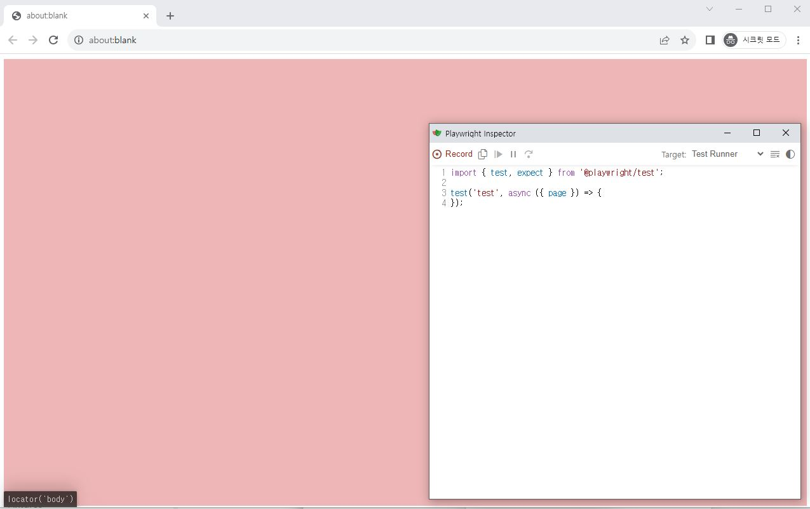

# Playwright

- Node.js 16+

## 1. 설치

```bash
# npm
$ npm init playwright@latest

# yarn
$ yarn create playwright
```


## 2. codegen

- 작업을 기록하여 테스트를 생성해줌
- 테스트를 사용자가 직접 제작하는 것이 아니라 해당 작업들을 코드로 변환해서 기록해줌
  - 자동으로 코드를 생성해주기 때문에 처음 접하는 사람이 쉽게 대략적인 테스트 코드 작성 가능
- 일반적인 화면에서는 모두 가능하지만, 네트워크 상황을 기다리거나 하는 등의 작업이 필요한 경우 직접 해당 부분을 제어해줘야 함

```bash
$ npx playwright codegen

# 대상 url 주소를 명시하여 시작 가능
$ npx playwright codegen localhost:3000
```

- codegen을 이용하면 아래와 같은 화면 팝업
  

- 화면에서 작업을 하면, 아래 작은 화면에서 해당 작업을 코드로 변환
  - 단, 위에서 언급했다시피 SPA 기반 서비스나 화면의 일부만 바뀌는 등의 작업은 제어 필요

## 3. 테스트

### 3.1 로그인 유지

- 해당 작업을 하고나면 테스트 전에 로그인을 미리 해두어 각 테스트에 로그인이 필요하지 않음

- `playwright.config.ts`

  ```typescript
  export default defineConfig({
    globalSetup: require.resolve('./global-setup'),
    globalTeardown: require.resolve('./global-setup'),
    ...
    use: {
      ...
      storageState: './.auth.json' // 로그인 정보를 담아두는 파일
    }
  });
  ```

- `global-setup.ts`

  ```typescript
  import { chromium, FullConfig } from '@playwright/test';

  async function globalSetup(config: FullConfig) {
    const { baseURL, storageState } = config.projects[0].use;

    const browser = await chromium.launch();
    const context = await browser.newContext({ ignoreHTTPSErrors: true });
    const page = await context.newPage();

    // 로그인 로직

    await page.context().storageState({ path: storageState as string });
    await browser.close();
  }

  export default globalSetup;
  ```

  - 여러 아이디 로그인 방법
    - 위에 먼저 기술한 `gloabl-setup`의 경우에는 전역 설정 파일을 사용하게 되어 프로젝트 전체에 영향을 미침
    - 하지만, 아래와 같이 설정하면 추가적인 아이디나 패스워드를 이용한 테스트를 진행 가능
      ```javascript
      // playwright.config.ts
      export default defineConfig({
        ...
        projects: [
          ...
          {
            name: 'setup'
            testMatch: /global.setup\.ts/
          },
          {
            name: 'chromium',
            use: { ...devices['Desktop chrome'] },
            dependencies: ['setup']
          }
        ]
      })
      ```

### 3.2 선택자
- 선택자를 이용하여 요소를 선택하면, 다양한 상호작용이 가능한 함수를 사용 가능
  - `click()`, `type()`, `fill()`, `press()`, `check()`, `selectOption()`, `hover()` 등
#### 2.2.1 locator

- 웹 페이지에서 요소를 찾고 상호작용하기 위함
- CSS Selector, XPath 등 다양한 방법 사용 가능

- `page.locator(selector)`
  - 페이지에서 요소 찾기
  ```javascript
  const element = await page.locator('button.my-button');
  ```

- `element.locator(selector)`
  - 요소 내에서 하위 요소 찾기
  ```javascript
  const button = await element.locator('button');
  ```

- `element.locatorAll(selector)`
  - 요소 내에서 하위 요소 중 여러 개의 요소 모두 찾기
  ```javascript
  const buttons = await element.locatorAll('button');
  ```

### 3.3 dialog

- `alert()`, `confirm()`, `prompt()` 등의 dialog에서도 사용 가능
- 이벤트에 대한 리스너를 미리 등록
- 단, 화면에 여러 이벤트가 존재한다면 message에 따라서 분기가 필요해 보임

  ```javascript
  page.on('dialog', async dialog => {
    const message = dialog.message();

    if (message === '...')  {
      // 경고창
      await dialog.dismiss();
    } else if (...) {
      // 확인창
      await dialog.accept();
    }
  });

  await page.getByRole('button', { name: '확인' }).click();
  ```

### 3.4 style

- 특정 요소에 CSS가 포함되어 있는지를 검사
- 단, 색상의 경우 16진수 표기법이 아닌 rgb 표기법으로만 가능

```javascript
expect(page.locator('css selector')).toHaveCSS('background-color', 'rgb(112, 173, 71)');
```

### 3.5 response

- 특정 요청을 보낸 후 특정 응답이나 값, 상태 등을 확인

```javascript
// 기본
await page.waitForResponse(res => (
  res.url().includes('요청 URL')
  && res.status() === 200
), {
  timeout: 10 * 1000 // 해당 응답의 응답 시간도 기다릴 수 있음 기본값은 30000
});

// 특정 응답값을 함께 검사
await page.waitForResponse(res => {
  const result = await res.json();

  return (
    res.url().includes('요청 URL')
    && res.status() === 200
    && result.status === 'DONE'
  );
})
```
